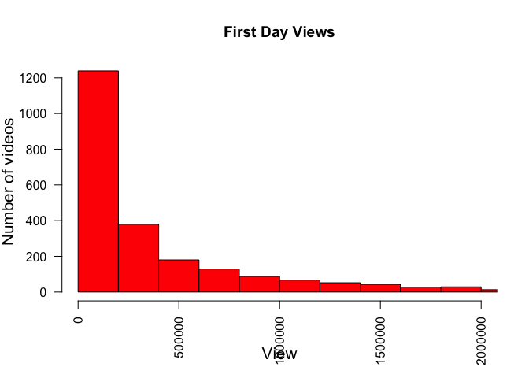
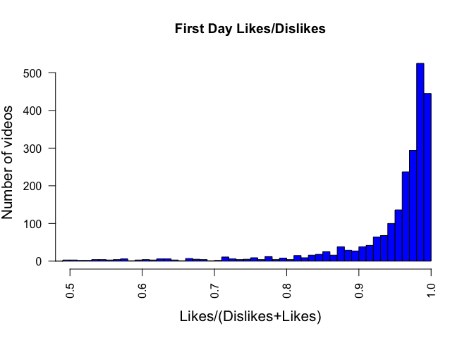

# Features of the trending videos on Youtube
Hoora Abdehkakha  
`r format(Sys.Date())`  

In this notebook, I explore Youtube's top trending videos and comments dataset. 
The dataset includes:
Features are: video_id,title,channel_title,category_id,tags,views,likes,dislikes,comment_total,thumbnail_link,date


```r
inputfile=read.csv("data/USvideos.csv",header = TRUE)
category_name=read.table("data/US_category_id.txt")
attach(inputfile)
```

To predict if a video can be a trend, unsupervised learning algorithms are appropriate. I will use diffrent clustering algorithms to predict wether a video is going to be in top 200 trending videos. 


```r
# Survival features unique videos
a <- table(video_id)
survaival = array(1:dim(inputfile)[1]) 
for (i in 1:dim(inputfile)[1]) {
  survaival[i]=a[names(a)==video_id[i]]
} 
first_day_views = array(1:dim(a))
first_day_likes = array(1:dim(a))
first_day_dislikes = array(1:dim(a))
category_id_u = array(1:dim(a))

for (i in 1:dim(a)){
  j = 1
  while (video_id[j] != names(a[i]))
  {
      j = j + 1 
  }
  first_day_views[i] = views[j]
  first_day_likes[i] = likes[j] 
  first_day_dislikes[i] = dislikes[j]
  category_id_u[i] = survaival[j]
}
```


```r
# first day like and dislike
# Category histogram
hist(first_day_views, col = "red", breaks=200, xlim=c(0,2000000), main="First Day Views", las=2, xlab = "View", ylab = "Number of videos", cex.lab = 1.3)
```

<!-- -->


```r
hist(first_day_likes/(first_day_dislikes+first_day_likes), col = "blue", breaks=100, xlim=c(0.5,1), main="First Day Likes/Dislikes", las=2, xlab = "Likes/(Dislikes+Likes)", ylab = "Number of videos", cex.lab = 1.3)
```

<!-- -->


```r
# Scaling
#inputfile.scaled= matrix(data = NA, nrow=dim(a), ncol=4)
inputfile.scaled = data.frame(scale(first_day_views), scale(first_day_likes), scale(first_day_dislikes), category_id_u)
# Scale
#inputfile.scaled[,1]=scale(first_day_views)
#inputfile.scaled[,2]=scale(first_day_likes)
#inputfile.scaled[,3]=scale(first_day_dislikes)
#inputfile.scaled[,4]=category_id_u

# check that we get mean of 0 and sd of 1
colMeans(inputfile.scaled)
```

```
##    scale.first_day_views.    scale.first_day_likes. 
##             -2.788693e-17              8.095009e-18 
## scale.first_day_dislikes.             category_id_u 
##             -6.152710e-18              3.384095e+00
```

```r
apply(inputfile.scaled, 2, sd)
```

```
##    scale.first_day_views.    scale.first_day_likes. 
##                  1.000000                  1.000000 
## scale.first_day_dislikes.             category_id_u 
##                  1.000000                  1.578157
```

```r
attach(inputfile.scaled)
```

```
## The following object is masked _by_ .GlobalEnv:
## 
##     category_id_u
```


```r
# Sample data -----------------------------------------------------------------------

set.seed(1)
train = sample(1:dim(inputfile.scaled)[1], dim(inputfile.scaled)[1]*0.9)
test = -train
train_set = inputfile.scaled[train, ]
test_set = inputfile.scaled[test, ]
xtrain=inputfile.scaled[train, 1:3]
xtest=inputfile.scaled[test,1:3 ]
ytrain=inputfile.scaled[train, 4]
ytest=inputfile.scaled[test, 4]
```


```r
# Linear regresion---------------------------------------------------------
lm.fit=lm(category_id_u~scale.first_day_views.+scale.first_day_likes.+scale.first_day_dislikes.,data=train_set)
summary(lm.fit)
```

```
## 
## Call:
## lm(formula = category_id_u ~ scale.first_day_views. + scale.first_day_likes. + 
##     scale.first_day_dislikes., data = train_set)
## 
## Residuals:
##     Min      1Q  Median      3Q     Max 
## -3.9701 -1.3443 -0.3308  1.5250  4.6236 
## 
## Coefficients:
##                           Estimate Std. Error t value Pr(>|t|)    
## (Intercept)                3.38311    0.03390  99.782  < 2e-16 ***
## scale.first_day_views.    -0.10150    0.05815  -1.746  0.08102 .  
## scale.first_day_likes.     0.18820    0.05885   3.198  0.00140 ** 
## scale.first_day_dislikes.  0.09614    0.03626   2.652  0.00807 ** 
## ---
## Signif. codes:  0 '***' 0.001 '**' 0.01 '*' 0.05 '.' 0.1 ' ' 1
## 
## Residual standard error: 1.564 on 2123 degrees of freedom
## Multiple R-squared:  0.01365,	Adjusted R-squared:  0.01226 
## F-statistic: 9.794 on 3 and 2123 DF,  p-value: 2.045e-06
```

```r
coef(lm.fit)
```

```
##               (Intercept)    scale.first_day_views. 
##                3.38310516               -0.10150041 
##    scale.first_day_likes. scale.first_day_dislikes. 
##                0.18820478                0.09614496
```

```r
cor(inputfile.scaled)
```

```
##                           scale.first_day_views. scale.first_day_likes.
## scale.first_day_views.                1.00000000              0.8179013
## scale.first_day_likes.                0.81790134              1.0000000
## scale.first_day_dislikes.             0.41248392              0.4370608
## category_id_u                         0.06860372              0.1001864
##                           scale.first_day_dislikes. category_id_u
## scale.first_day_views.                   0.41248392    0.06860372
## scale.first_day_likes.                   0.43706076    0.10018635
## scale.first_day_dislikes.                1.00000000    0.08984001
## category_id_u                            0.08984001    1.00000000
```


```r
# test sets error
lm.pr=predict(lm.fit,test_set)
RSS = sqrt(mean((lm.pr - test_set$category_id_u)**2))
Error_test = mean(abs(lm.pr - test_set$category_id_u) / test_set$category_id_u )
Error_test * 100
```

```
## [1] 65.56341
```

```r
# train error
lm.pr=predict(lm.fit,train_set)
RSS = sqrt(mean((lm.pr - train_set$category_id_u)**2))
Error_train = mean(abs(lm.pr - train_set$category_id_u) / train_set$category_id_u )
Error_train * 100
```

```
## [1] 63.03723
```


High train and test set errors show high bias. The model is too simple.
