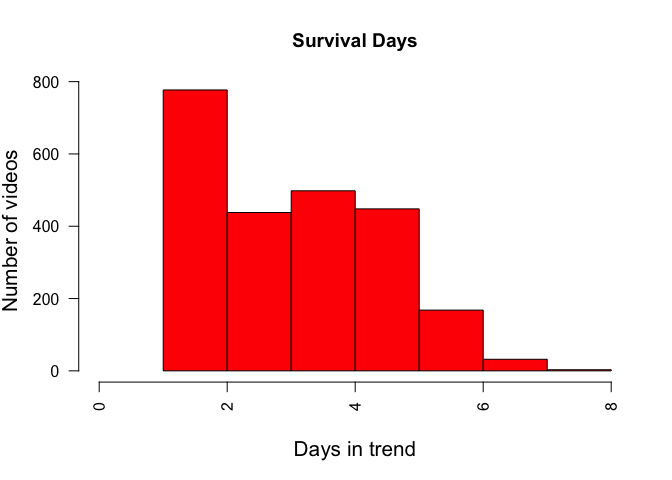

# Features of the trending videos on Youtube
Hoora Abdehkakha  
`r format(Sys.Date())`  

In this notebook, I explore Youtube's top trending videos and comments dataset. 
The dataset includes:
Great Britain and US video stats in files 'GBvideos.csv' and \'USvideos.csv'.
Great Britain and US video comments in files 'GBcomments.csv' and \'UScomments.csv'.
Category id names in files 'US_category_id.json' and \'GB_category_id.json'.

I am intersted to find the most important charectrestics of top trending videos. 
My goal is to predict if a video can be a trend and make sugesstions to improve the chance of being in the high trend category. Some videos are only trending for 1 day and some stay in this category for longer time. We can improve our chance of being a trend by exploring the most improtant features of survired videos. 
Dataset "Trending YouTube Video Statistics and Comments: Daily statistics (views, likes, category, comments+) for trending YouTube videos" are downloaded from link https://www.kaggle.com/datasnaek/youtube.

Here I load the US top trending videos.

Features are: video_id,title,channel_title,category_id,tags,views,likes,dislikes,comment_total,thumbnail_link,date


```r
inputfile=read.csv("data/USvideos.csv",header = TRUE)
category_name=read.table("data/US_category_id.txt")
attach(inputfile)
```

Maximum days that a video still is trending is 8 days. 
Plot shows that many videos cannot keep their position in high trending category. 

```r
# survaival days
a <- table(video_id)
survaival = array(1:dim(inputfile)[1]) 
id = character(dim(inputfile)[1])

for (i in 1:dim(inputfile)[1]) {
  survaival[i]=a[names(a)==video_id[i]]
  id[i] <- as.character(category_name$V3[category_name$V1 == category_id[i]] )
} 

# Category histogram
hist(a, col = "red", breaks=8, xlim=c(0,8), main="Survival Days", las=2, xlab = "Days in trend", ylab = "Number of videos", cex.lab = 1.3)
```

<!-- -->

Entertainment -> Music -> Vlog&Blogs are trending most.


```r
# Categories
b <- table(id)
barplot(b, col = "blue", main="The Most trending Categories", las=3, ylab = "Number of videos", cex.lab = 1.5)
```

<!-- -->

Tags such as makeup, iphone, music, and funny have been used most frequently in trending videos. It is highly related to people interests and the relevent news or events. For instance, makeup is highly related to halloween; iphone8 has been released recently and ...


```r
# Tags
aa <- list()
for (i in 1:dim(inputfile)[1]){
 aa[[length(aa) + 1]] <- unlist(strsplit(as.character(tags[i]), "[|, ]"))
}
cc = unlist(aa)
c <- table(cc)
d = sort(c)
most_tags=c('movie', 'iphone', 'trailer', 'show', 'halloween', 'food', 'new', 'news', '2017', 'comedy', 'music', 'makeup', 'funny', 'tutorial')
most_tags_number=c(d[names(d) == "Movie"]+ d[names(d) == "Movies"] + d[names(d) == "movie"] + d[names(d) == "movies"],  
                   d[names(d) == "iphone"]+ d[names(d) == "iPhone"] , d[names(d) == "trailer"]+ d[names(d) == "Trailer"],
                   d[names(d) == "show"] + d[names(d) == "Show"], d[names(d) == "halloween"] + d[names(d) == "Halloween"], d[names(d) == "food"] + d[names(d) == "Food"], d[names(d) == "new"] + d[names(d) == "New"],
                   d[names(d) == "news"] + d[names(d) == "News"], d[names(d) == "2017"] ,  d[names(d) == "comedy"] + d[names(d) == "Comedy"],
                   d[names(d) == "music"] + d[names(d) == "Music"], d[names(d) == "makeup"] + d[names(d) == "Makeup"], d[names(d) == "funny"] + d[names(d) == "Funny"] ,
                   d[names(d) == "tutorial"] + d[names(d) == "Tutorial"])

barplot(most_tags_number, col = "green", main="The Most Used Tags", las=3, ylab = "Frequency", cex.lab = 1.5, names.arg=most_tags)
```

<!-- -->

