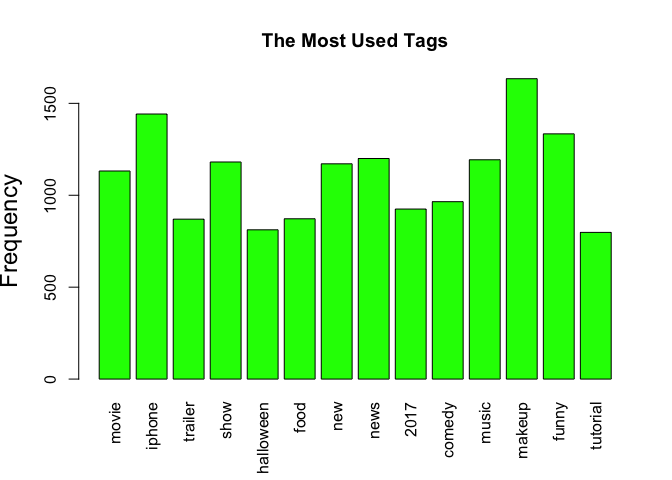

# R Notebook


```r
inputfile=read.csv("/Users/hoora/Documents/Interview/Data_Incubator/Semifinal/Challenge/youtube/USvideos.csv",header = TRUE)
summary(inputfile)
```

```
##         video_id   
##  Hlt3rA-oDao:   8  
##  LunHybOKIjU:   8  
##  Oo0NJsr5m4I:   8  
##  1QWLyi03twg:   7  
##  3QWQ4gN3j4E:   7  
##  4X6a3G_0HjY:   7  
##  (Other)    :7955  
##                                                              title     
##  Eminem Rips Donald Trump In BET Hip Hop Awards Freestyle Cypher:   8  
##  IT PENNYWISE GLAM HALLOWEEN MAKEUP TUTORIAL                    :   8  
##  Kellywise - SNL                                                :   8  
##  Tourist terrified by new glass walkway that cracks under weight:   8  
##  1 YEAR OF VLOGGING -- HOW LOGAN PAUL CHANGED YOUTUBE FOREVER!  :   7  
##  Apple iPhone X first look                                      :   7  
##  (Other)                                                        :7954  
##                                 channel_title   category_id   
##  Jimmy Kimmel Live                     :  40   Min.   : 1.00  
##  Vox                                   :  40   1st Qu.:17.00  
##  First We Feast                        :  39   Median :23.00  
##  jacksfilms                            :  38   Mean   :20.22  
##  NFL                                   :  38   3rd Qu.:25.00  
##  The Tonight Show Starring Jimmy Fallon:  38   Max.   :43.00  
##  (Other)                               :7767                  
##                                                                                                                                                                                                                                                                                                                                                                                             tags     
##  [none]                                                                                                                                                                                                                                                                                                                                                                                       : 491  
##  James Corden|The Late Late Show|Colbert|late night|late night show|Stephen Colbert|Comedy|monologue|comedian|impressions|celebrities|carpool|karaoke|CBS|Late Late Show|Corden|joke|jokes|funny|funny video|funny videos|humor|celebrity|celeb|hollywood|famous                                                                                                                              :  37  
##  The Late Show|Stephen Colbert|Colbert|Late Show|celebrities|late night|talk show|skits|bit|monologue|The Late Late Show|Late Late Show|letterman|david letterman|comedian|impressions|CBS|joke|jokes|funny|funny video|funny videos|humor|celebrity|celeb|hollywood|famous|James Corden|Corden|Comedy                                                                                        :  30  
##  cupcakes|how to make vanilla cupcakes|over the top recipes|easy cupcake recipes|vanilla cupcakes|chocolate cupcakes|french macarons|how to make macarons|the scran line|the scranline|nick makrides|pastry design|how to pipe cupcakes                                                                                                                                                       :  25  
##  America's Got Talent 2017|america's got talent|america's got talent fails|america's got talent best|america's got talent auditions|AGT|AGT 2017 auditions|AGT best auditions|NBC|TV|TV Shows|Highlights|Previews|Simon Cowell|Howie Mandel|Tyra Banks|Heidi Klum|Mel B|season 12|America's|Got|Talent|funny|judge|vote|clips|talent|entertainment|competition|biggest talent show|talent show:  13  
##  physics|minutephysics|science                                                                                                                                                                                                                                                                                                                                                                :  11  
##  (Other)                                                                                                                                                                                                                                                                                                                                                                                      :7393  
##      views              likes            dislikes      comment_total     
##  Min.   :       0   Min.   :      0   Min.   :     0   Min.   :     0.0  
##  1st Qu.:   96906   1st Qu.:   1904   1st Qu.:    68   1st Qu.:   286.8  
##  Median :  308868   Median :   8652   Median :   273   Median :  1087.0  
##  Mean   :  939446   Mean   :  34526   Mean   :  1781   Mean   :  4612.3  
##  3rd Qu.:  960604   3rd Qu.:  30279   3rd Qu.:  1014   3rd Qu.:  3466.2  
##  Max.   :41500672   Max.   :2010366   Max.   :318404   Max.   :736179.0  
##                                                                          
##                                         thumbnail_link      date      
##  https://i.ytimg.com/vi/Hlt3rA-oDao/default.jpg:   8   Min.   : 1.10  
##  https://i.ytimg.com/vi/LunHybOKIjU/default.jpg:   8   1st Qu.:10.85  
##  https://i.ytimg.com/vi/Oo0NJsr5m4I/default.jpg:   8   Median :16.59  
##  https://i.ytimg.com/vi/1QWLyi03twg/default.jpg:   7   Mean   :16.10  
##  https://i.ytimg.com/vi/3QWQ4gN3j4E/default.jpg:   7   3rd Qu.:21.35  
##  https://i.ytimg.com/vi/4X6a3G_0HjY/default.jpg:   7   Max.   :30.09  
##  (Other)                                       :7955
```

```r
attach(inputfile)
category_name=read.table("/Users/hoora/Documents/Interview/Data_Incubator/Semifinal/Challenge/youtube/US_category_id.json")
```


```r
# survaival days

a <- table(video_id)
survaival = array(1:dim(inputfile)[1]) 
id_d = array(1:dim(inputfile)[1])
id = character(dim(inputfile)[1])

for (i in 1:dim(inputfile)[1]) {
  survaival[i]=a[names(a)==video_id[i]]
  id_d[i] <- category_id[i]
  id[i] <- as.character(category_name$V3[category_name$V1 == category_id[i]] )
} 

# Category histogram
library(plotly)
```

```
## Loading required package: ggplot2
```

```
## 
## Attaching package: 'plotly'
```

```
## The following object is masked from 'package:ggplot2':
## 
##     last_plot
```

```
## The following object is masked from 'package:stats':
## 
##     filter
```

```
## The following object is masked from 'package:graphics':
## 
##     layout
```

```r
b <- table(id)
plot_ly( x = ~names(b), y = ~b, type = 'bar')
```

<!--html_preserve--><div id="f5cc18dc2dd9" style="width:672px;height:480px;" class="plotly html-widget"></div>
<script type="application/json" data-for="f5cc18dc2dd9">{"x":{"visdat":{"f5cc5472404f":["function () ","plotlyVisDat"]},"cur_data":"f5cc5472404f","attrs":{"f5cc5472404f":{"x":{},"y":{},"alpha":1,"sizes":[10,100],"type":"bar"}},"layout":{"margin":{"b":40,"l":60,"t":25,"r":10},"xaxis":{"domain":[0,1],"title":"names(b)","type":"category","categoryorder":"array","categoryarray":["Autos & Vehicles","Comedy","Education","Entertainment","Film & Animation","Gaming","Howto & Style","Music","News & Politics","Nonprofits & Activism","People & Blogs","Pets & Animals","Science & Technology","Shows","Sports","Travel & Events"]},"yaxis":{"domain":[0,1],"title":"b"},"hovermode":"closest","showlegend":false},"source":"A","config":{"modeBarButtonsToAdd":[{"name":"Collaborate","icon":{"width":1000,"ascent":500,"descent":-50,"path":"M487 375c7-10 9-23 5-36l-79-259c-3-12-11-23-22-31-11-8-22-12-35-12l-263 0c-15 0-29 5-43 15-13 10-23 23-28 37-5 13-5 25-1 37 0 0 0 3 1 7 1 5 1 8 1 11 0 2 0 4-1 6 0 3-1 5-1 6 1 2 2 4 3 6 1 2 2 4 4 6 2 3 4 5 5 7 5 7 9 16 13 26 4 10 7 19 9 26 0 2 0 5 0 9-1 4-1 6 0 8 0 2 2 5 4 8 3 3 5 5 5 7 4 6 8 15 12 26 4 11 7 19 7 26 1 1 0 4 0 9-1 4-1 7 0 8 1 2 3 5 6 8 4 4 6 6 6 7 4 5 8 13 13 24 4 11 7 20 7 28 1 1 0 4 0 7-1 3-1 6-1 7 0 2 1 4 3 6 1 1 3 4 5 6 2 3 3 5 5 6 1 2 3 5 4 9 2 3 3 7 5 10 1 3 2 6 4 10 2 4 4 7 6 9 2 3 4 5 7 7 3 2 7 3 11 3 3 0 8 0 13-1l0-1c7 2 12 2 14 2l218 0c14 0 25-5 32-16 8-10 10-23 6-37l-79-259c-7-22-13-37-20-43-7-7-19-10-37-10l-248 0c-5 0-9-2-11-5-2-3-2-7 0-12 4-13 18-20 41-20l264 0c5 0 10 2 16 5 5 3 8 6 10 11l85 282c2 5 2 10 2 17 7-3 13-7 17-13z m-304 0c-1-3-1-5 0-7 1-1 3-2 6-2l174 0c2 0 4 1 7 2 2 2 4 4 5 7l6 18c0 3 0 5-1 7-1 1-3 2-6 2l-173 0c-3 0-5-1-8-2-2-2-4-4-4-7z m-24-73c-1-3-1-5 0-7 2-2 3-2 6-2l174 0c2 0 5 0 7 2 3 2 4 4 5 7l6 18c1 2 0 5-1 6-1 2-3 3-5 3l-174 0c-3 0-5-1-7-3-3-1-4-4-5-6z"},"click":"function(gd) { \n        // is this being viewed in RStudio?\n        if (location.search == '?viewer_pane=1') {\n          alert('To learn about plotly for collaboration, visit:\\n https://cpsievert.github.io/plotly_book/plot-ly-for-collaboration.html');\n        } else {\n          window.open('https://cpsievert.github.io/plotly_book/plot-ly-for-collaboration.html', '_blank');\n        }\n      }"}],"cloud":false},"data":[{"x":["Autos & Vehicles","Comedy","Education","Entertainment","Film & Animation","Gaming","Howto & Style","Music","News & Politics","Nonprofits & Activism","People & Blogs","Pets & Animals","Science & Technology","Shows","Sports","Travel & Events"],"y":[116,756,334,1601,378,82,870,1252,626,14,883,116,512,2,410,48],"type":"bar","marker":{"fillcolor":"rgba(31,119,180,1)","color":"rgba(31,119,180,1)","line":{"color":"transparent"}},"xaxis":"x","yaxis":"y","frame":null}],"highlight":{"on":"plotly_click","persistent":false,"dynamic":false,"selectize":false,"opacityDim":0.2,"selected":{"opacity":1}},"base_url":"https://plot.ly"},"evals":["config.modeBarButtonsToAdd.0.click"],"jsHooks":{"render":[{"code":"function(el, x) { var ctConfig = crosstalk.var('plotlyCrosstalkOpts').set({\"on\":\"plotly_click\",\"persistent\":false,\"dynamic\":false,\"selectize\":false,\"opacityDim\":0.2,\"selected\":{\"opacity\":1}}); }","data":null}]}}</script><!--/html_preserve-->


```r
b
```

```
## id
##      Autos & Vehicles                Comedy             Education 
##                   116                   756                   334 
##         Entertainment      Film & Animation                Gaming 
##                  1601                   378                    82 
##         Howto & Style                 Music       News & Politics 
##                   870                  1252                   626 
## Nonprofits & Activism        People & Blogs        Pets & Animals 
##                    14                   883                   116 
##  Science & Technology                 Shows                Sports 
##                   512                     2                   410 
##       Travel & Events 
##                    48
```


```r
plot(category_id, likes, xlim=c(0,30), xlab="Category ID", ylab="Likes")
```

<!-- -->

